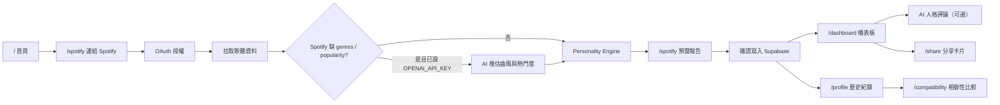
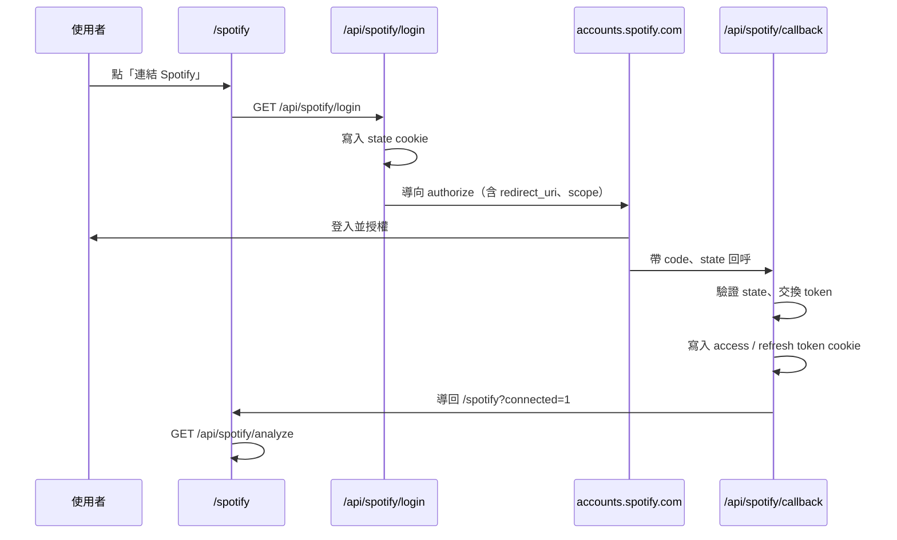

# Life is Fine

以 Spotify 聆聽習慣推算音樂人格的生活紀錄平台。使用者連結 Spotify 後，系統分析 Top Artists／Tracks 與最近播放，產出六項人格特質、主人格／副人格原型，並可儲存歷史報告、分享卡片與比較相容性。

技術棧：Next.js App Router、TypeScript、Tailwind CSS v4、Zustand、Supabase、OpenAI（可選）。

## 產品流程



| 階段 | 頁面／API | 說明 |
|------|-----------|------|
| 1. 連結帳號 | `/spotify` → `/api/spotify/login` | OAuth 授權，token 存於 httpOnly cookie |
| 2. 拉取資料 | `GET /api/spotify/analyze` | 呼叫 Spotify Web API（Top Artists／Tracks、最近播放） |
| 3. 訊號轉換 | `spotifyToPersonalityInput` | 將原始資料轉為人格引擎輸入訊號 |
| 4. AI 補強（可選） | `inferListeningSignals` | Spotify 缺欄位時，以藝人／曲名推估（見下方標示表） |
| 5. 人格分析 | Personality Engine | 產出六項特質、主人格／副人格、分數 |
| 6. 預覽確認 | `/spotify` preview | 使用者確認後寫入 Supabase，導向儀表板 |
| 7. 儀表板 | `/dashboard` | 雷達圖、特質卡、分享；可另請求 AI 文字評論 |
| 8. 歷史與比較 | `/profile`、`/compatibility` | 讀取 Supabase 歷史報告；兩份報告比對相容性 |

> `/detect`、`/assessment` 會重新導向至 `/spotify`。

## 主要路由

| 路由 | 說明 |
|------|------|
| `/` | 首頁 |
| `/spotify` | Spotify 連結、分析預覽、確認寫入 |
| `/dashboard` | 人格報告儀表板（需 Zustand 已有 profile） |
| `/profile` | 歷史人格報告列表（Supabase） |
| `/compatibility` | 兩份歷史報告相容性比較 |
| `/share` | 分享頁／下載分享卡 |
| `/about`、`/contact`、`/privacy`、`/terms` | 靜態頁 |

## 專案結構

```
src/
├── app/           # App Router 路由與全域樣式
├── components/    # 共用 UI 元件（Layout、Theme）
├── features/      # 功能模組（Feature-based）
├── hooks/         # 自訂 React Hooks
├── services/      # API 與外部服務
├── store/         # Zustand 狀態
├── lib/           # 工具函式、SEO metadata
├── types/         # 共用型別
└── constants/     # 站點常數、導覽設定
```

## 開始使用

```bash
cp .env.example .env.local
npm install
npm run dev
```

本機開發請用 [http://127.0.0.1:3000](http://127.0.0.1:3000)（見下方 Spotify 設定說明）。

若以區網 IP（如 `http://192.168.x.x:3000`）從手機或其他裝置連線，需額外設定 [`next.config.ts`](next.config.ts) 的 `allowedDevOrigins`（見下方「本機開發補充」）。

## 環境變數

| 變數 | 說明 |
|------|------|
| `NEXT_PUBLIC_SITE_URL` | 站點網址（SEO、sitemap；本機建議 `http://127.0.0.1:3000`） |
| `SPOTIFY_CLIENT_ID` | Spotify Developer 應用 Client ID |
| `SPOTIFY_CLIENT_SECRET` | Spotify Client Secret（僅伺服器端，勿加 `NEXT_PUBLIC_`） |
| `SPOTIFY_REDIRECT_URI` | OAuth 回呼網址，須與 Dashboard Redirect URI **完全一致** |
| `NEXT_PUBLIC_SUPABASE_URL` | Supabase 專案 URL（歷史人格報告 `personality_reports`） |
| `NEXT_PUBLIC_SUPABASE_ANON_KEY` | Supabase anon key |
| `OPENAI_API_KEY` | 可選；啟用「聆聽訊號 AI 補強」與「儀表板 AI 人格評論」 |
| `OPENAI_MODEL` | 可選；OpenAI 模型，預設 `gpt-4o-mini` |

### Spotify 與人格分析

#### Spotify 實際拉取的資料

授權 scope：`user-top-read`、`user-read-recently-played`、`user-read-private`。

| Spotify API | 用途 |
|-------------|------|
| `GET /me` | 使用者顯示名稱 |
| `GET /me/top/artists`（short / medium term） | 熱門藝人、曲風標籤、藝人熱門度 |
| `GET /me/top/tracks`（short term） | 熱門曲目、曲目熱門度 |
| `GET /me/player/recently-played` | 最近播放、重複聆聽、近期藝人多樣性 |

#### Spotify 缺漏或不可靠的欄位（Development Mode，2026 年起）

Spotify 在 Development Mode 已移除多數物件的 `popularity`，且實務上常不回傳 `genres`。詳見 [February 2026 Web API 變更](https://developer.spotify.com/documentation/web-api/references/changes/february-2026)。

| 欄位 | 狀態 | 影響 |
|------|------|------|
| `artists[].genres` | 常為空 | 曲風比例（chill、k-pop、indie 等）無法直接計算 |
| `artists[].popularity` | 常缺失 | 熱門度相關特質訊號偏弱 |
| `tracks[].popularity` | 常缺失 | 同上 |
| `recentlyPlayed[].artists[].id` | 有時缺失 | `recentArtistDiversity` 可能為 0 |
| `user.display_name` | 可為 null | 顯示名稱 fallback 為 Spotify 使用者 ID |

未補強時，人格引擎仍可依 **藝人重疊度**、**重複播放比例**、**近期藝人多樣性** 等 Spotify 直接提供的結構化訊號分析，但曲風與熱門度相關特質會明顯受限。

#### 資料來源與 AI 標示

專案中有 **兩種** OpenAI 用途，請勿混淆：

**A. 聆聽訊號 AI 補強**（分析管線內，影響人格分數）

| 項目 | 來源 | 說明 |
|------|------|------|
| 藝人／曲目名稱、ID、播放列表結構 | Spotify API | 官方資料 |
| 藝人重疊、重複播放、近期多樣性等 | 程式計算 | 由 Spotify 原始資料衍生 |
| `genres`（曲風標籤） | **AI 輔助生成** | 僅在 Spotify 無 genres 且已設 `OPENAI_API_KEY` 時，依名稱推估 |
| `avgArtistPopularity`、`avgTrackPopularity` | **AI 輔助生成** | 僅在 Spotify 無 popularity 且已設 `OPENAI_API_KEY` 時推估（0–100） |
| 六項人格特質、主人格／副人格 | Personality Engine | 規則引擎計算；若使用 AI 補強的 genres／popularity，間接受 AI 影響 |

AI 補強後，報告會帶 `signalEnrichment: { source: "ai", fields: [...] }`（`genres` 和／或 `popularity`）；`/spotify` 預覽頁會顯示「Spotify 未提供部分曲風／熱門度資料，已以 AI 依藝人與曲目名稱推估補強」。

**B. 儀表板 AI 人格評論**（分析完成後，不影響分數）

| 項目 | 來源 | 說明 |
|------|------|------|
| `humorousCommentary`（幽默評論） | **AI 輔助生成** | `POST /api/personality/commentary`，需 `OPENAI_API_KEY` |
| `toxicCommentary`（毒舌評論） | **AI 輔助生成** | 同上 |
| `yearlyTitle`（年度稱號） | **AI 輔助生成** | 同上 |

此評論以已產出的 `PersonalityProfile` 為輸入，純文字生成，**不會回寫或改變**人格分數與原型。

#### 分析管線（程式路徑）

```
fetchSpotifyListeningData
  → spotifyToPersonalityInput
  → needsListeningSignalEnrichment? ──是──→ inferListeningSignals (OpenAI)
  → analyzePersonalityFromInput (Personality Engine)
  → PersonalityProfile（可含 signalEnrichment）
```

### Spotify OAuth 設定

#### 授權流程



| 步驟 | 路由 | 說明 |
|------|------|------|
| 1 | `GET /api/spotify/login` | 產生 `state`，導向 Spotify 授權頁 |
| 2 | `GET /api/spotify/callback` | 驗證 `state`、以 `code` 換 token、寫入 cookie |
| 3 | `GET /api/spotify/session` | 前端查詢是否已連線 |
| 4 | `GET /api/spotify/analyze` | 拉取聆聽資料並跑人格分析 |
| 5 | `POST /api/spotify/logout` | 清除 session cookie |

`redirect_uri` 由 `SPOTIFY_REDIRECT_URI` 決定；若未設定，會 fallback 為 `{NEXT_PUBLIC_SITE_URL}/api/spotify/callback`。

#### 設定步驟

**1. Spotify Developer Dashboard**

於 [Spotify Developer Dashboard](https://developer.spotify.com/dashboard) 建立 App，取得 Client ID 與 Client Secret，並在 **Redirect URIs** 登記（須與環境變數一字不差）：

| 環境 | Redirect URI 範例 |
|------|-------------------|
| 本機 | `http://127.0.0.1:3000/api/spotify/callback` |
| Vercel 正式站 | `https://你的網域.vercel.app/api/spotify/callback` |

**2. `.env.local`（本機）**

```bash
NEXT_PUBLIC_SITE_URL=http://127.0.0.1:3000
SPOTIFY_CLIENT_ID=你的-client-id
SPOTIFY_CLIENT_SECRET=你的-client-secret
SPOTIFY_REDIRECT_URI=http://127.0.0.1:3000/api/spotify/callback
```

瀏覽器請開 `http://127.0.0.1:3000`，不要用 `localhost` 或區網 IP 測 Spotify 登入。

**3. Vercel（正式／Preview）**

於 **Settings → Environment Variables** 設定：

```bash
NEXT_PUBLIC_SITE_URL=https://你的網域.vercel.app
SPOTIFY_CLIENT_ID=你的-client-id
SPOTIFY_CLIENT_SECRET=你的-client-secret
SPOTIFY_REDIRECT_URI=https://你的網域.vercel.app/api/spotify/callback
```

儲存後需 **Redeploy** 才會生效。Dashboard 的 Redirect URI 也要加入同一條 HTTPS 網址。

#### Redirect URI 規則（2025 年起）

Spotify 已強制安全 Redirect URI，詳見 [官方說明](https://developer.spotify.com/documentation/web-api/concepts/redirect_uri)。

| Redirect URI | 是否允許 | 說明 |
|--------------|----------|------|
| `https://...` | ✅ | 正式站、Vercel |
| `http://127.0.0.1:PORT/...` | ✅ | 本機 loopback（開發用） |
| `http://localhost:PORT/...` | ❌ | 禁用 `localhost` 字樣 |
| `http://192.168.x.x:PORT/...` | ❌ | 區網 IP 視為 Insecure |

> Next.js dev server 會顯示 `Local: localhost:3000` 與 `Network: 192.168.x.x:3000`，但 **Spotify OAuth 本機只能用 `127.0.0.1`**。區網網址僅供同 WiFi 裝置連 dev server（例如 UI 預覽），無法完成 Spotify 登入。

若要在手機上測 Spotify 授權，請改用 Vercel 正式站，或以 ngrok / Cloudflare Tunnel 取得 HTTPS 網址並登記為 Redirect URI。

#### 常見錯誤

| 錯誤訊息 | 原因 | 解法 |
|----------|------|------|
| `redirect_uri: Not matching configuration` | env 與 Dashboard 不一致 | 三處比對：`.env`、Dashboard、瀏覽器授權 URL 的 `redirect_uri` 參數 |
| `redirect_uri: Insecure` | 使用了非 loopback 的 HTTP | 本機改 `127.0.0.1`；區網 IP 改 HTTPS 或 Vercel |
| `伺服器尚未設定 Spotify` | 缺少 Client ID / Secret | 檢查 env 並重啟 dev server / Redeploy |
| `invalid_state` | OAuth state cookie 不符 | 清除 cookie 重試；確認未混用不同網域 |
| `Blocked cross-origin request ... from "192.168.x.x"` | 區網 IP 未加入 dev 允許清單 | 見下方 `next.config.ts` 設定 |

#### 本機開發補充：`next.config.ts`

Next.js 16 預設阻擋非本機來源存取 dev 資源（如 `/_next/webpack-hmr`）。若要以終端機顯示的 **Network** 網址（例如 `http://192.168.0.15:3000`）從手機或同網段裝置預覽 UI，必須在 [`next.config.ts`](next.config.ts) 加入該 IP：

```ts
import type { NextConfig } from "next";

const nextConfig: NextConfig = {
  allowedDevOrigins: ["127.0.0.1", "192.168.0.15"], // 192.168.x.x 換成你終端機顯示的 Network IP
};

export default nextConfig;
```

修改後需**重啟 dev server**（`Ctrl+C` → `npm run dev`）。

注意：

- 此設定僅影響本機 HMR／dev 資源，**與 Spotify OAuth 無關**（Spotify 仍不接受 `http://192.168.x.x` 作為 Redirect URI）。
- 路由器重新分配 IP 後，記得更新 `allowedDevOrigins` 中的位址。
- 僅在本機用 `127.0.0.1` 開發時，可省略區網 IP，只保留 `"127.0.0.1"` 即可。

#### 開發除錯

- `GET /api/spotify/debug`（僅 `NODE_ENV=development`）：檢查原始資料與診斷 issue（含 genres／popularity 缺漏統計）
- `node scripts/spotify-diagnose.mjs "<access_token>"`：直接對 Spotify API 驗證欄位

### Supabase 歷史報告

使用者於 `/spotify` 確認報告後，以本機 `localUserId`（localStorage）關聯寫入 `personality_reports` 表；`/profile` 列出歷史、`/compatibility` 取兩份報告比較。

在 SQL Editor 依序執行：

1. `src/features/personality-reports/sql/personality_reports.sql`
2. `src/features/personality-reports/sql/personality_reports_rls_dev.sql`（本機開發用）

儲存內容包含：`PersonalityProfile`（含 `signalEnrichment` 標記）、可選的 AI 人格評論文字。

## 指令

```bash
npm run dev    # 開發伺服器
npm run build  # 正式建置
npm run start  # 啟動正式伺服器
npm run lint   # ESLint
```
